# The Journey to "on Chain" agreements (contracts)

{:toc}

## The concepts

### In the beginning

- Contracts: Financial, insurance, Hotel, Flight etc can be offered by a supplier over the internet.
- The contract is offered and agreed over the internet, optionally references some public data and is settled for cash via digital payment.

[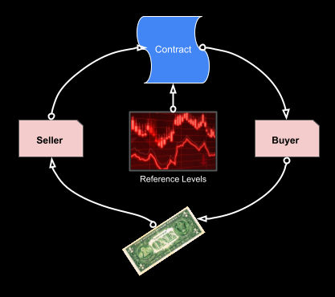](../resources/basics-1.pdf)

### What is "on-chain"

- Most services to date, including the internet rely on and are managed by central authorities.
- An on-chain example is [Ethereum](https://en.wikipedia.org/wiki/Ethereum), which is the software and services that provide a platform which is in effect a decentralized super-computer
  - It is decentralized as:
    - it supports people and organizations connecting and transacting **directly** in a secure way
    - the computation and storage is not centrally owned.
  - It has the ability to store and run-programs called smart contracts
- So, "on-chain" is a service (distributed App [dApp](https://en.wikipedia.org/wiki/Decentralized_application)) that has been implemented on top of such as decentralized network
- Operations such as computation and storage are paid for in the form of "gas fees" which are normally settled between parties using a crypto currency such as [Ether](https://en.wikipedia.org/wiki/Ethereum#Ether).

### What is a Smart Contract

- A smart-contract is a piece of code that runs "on-chain" and forms part of a distributed App [dApp](https://en.wikipedia.org/wiki/Decentralized_application).
- The code is much like other programming languages. However as the smart contracts can be executed by anyone who has on-chain presence, smart-contracts once on-chain cannot be modified and have special features that restrict who (which wallet) can execute which functions in the program.
- Another important aspect of these smart contracts is that they can be given common capabilities, an example of this is the [ERC-20 standard](https://ethereum.org/en/developers/docs/standards/tokens/erc-20/) that is the emerging standard for how all Token behave.
- This standardization means we can build decentralized eco-systems of services that can interact with each other by using these standard capabilities.

### The Move to chain

- This first requires that individuals and organizations have a presence on-chain. This comes in the form of a Wallet, which is a secured Id that we use to transact with other entities via their Wallet.
- Every participant has a unique Id that is their on-chain identity. This must be kept secure, with access to the wallet anyone can access the assets associated with that wallet or act as that wallet.
- There are many services such as [Meta-mask](https://metamask.io/) that can create and manage your wallet and track your on-chain assets for you.

[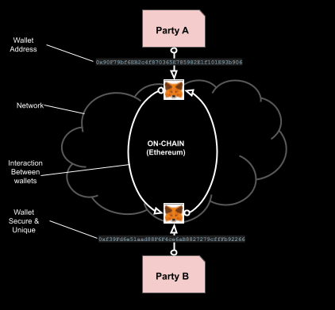](../resources/basics-1.5.pdf)

### Assets on chain - ERC20 Tokens

- We need a representation of value on-chain. This can be done with digital-coins such as Bit-Coin and Ethereum etc.
- However, a more flexible option is to use a Token, which is a smart contract that can represent any asset.
- An emerging standard here is [ECR-20](https://ethereum.org/en/developers/docs/standards/tokens/erc-20/), which gives all tokens the same set of behaviors
- This makes it possible for all of the different wallet services to cooperate in exchange of Token and digital coins.
- Tokens can be "asset backed" and represent any asset on-chain, cash, property, commodity, shares etc.
- A similar idea is when you buy chips at a casino. You exchange real currency at the door for chips (tokens), which you use inside to play at the tables (on-chain) and then swap the chips (tokens) back for cash when you leave.

[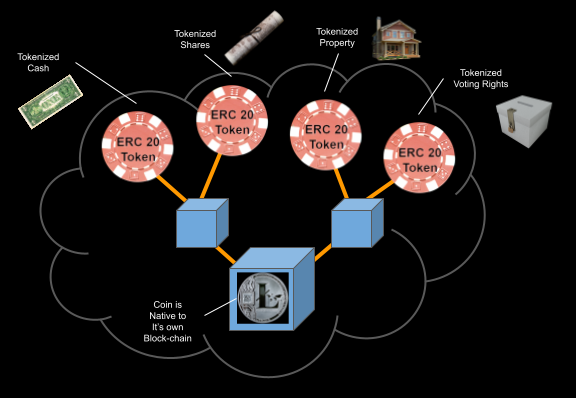](../resources/basics-1.6.pdf)

- Token are smart contract (code) that manages the basic capabilities of a token
  - create more tokens, **minting** in response to more assets being added.
  - destroying token, **burning** in response ot assess being disassociated with the token
  - **transfer** of a number of tokens from one Wallet to another
  - **tracking** the balance of a token against all the holding wallets.

[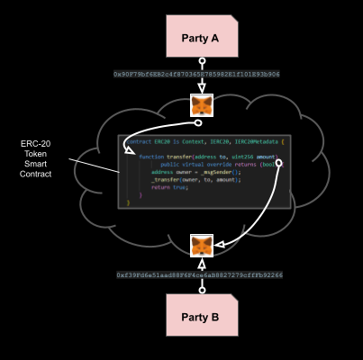](../resources/basics-1.7.pdf)

### Agreements (contracts) on Chain

- We have value on chain in the form of Tokens (and coins) we can make (buy) and settle agreements (contracts).
- Now, we need a way to represent the agreement and the how we enter into and exit that agreement.
- For this we can use a [Non Fungible Token (NFT)](https://en.wikipedia.org/wiki/Non-fungible_token)
- The [NFT](https://en.wikipedia.org/wiki/Non-fungible_token) is a smart-contract that has:
  - An owner
  - A means to point at some specific asset or digital agreement
- So, if we create an NFT that is a represents digital ownership of something, we can then transfer the ownership for a fee that can be paid for with a Token (or crypto currency).
- As with tokens there are emerging standards for such NFTs, [ERC-721](https://eips.ethereum.org/EIPS/eip-721) and [ERC-1155](https://ethereum.org/en/developers/docs/standards/tokens/erc-1155/). This gives them standard features that make them easier to manage and transact
  
[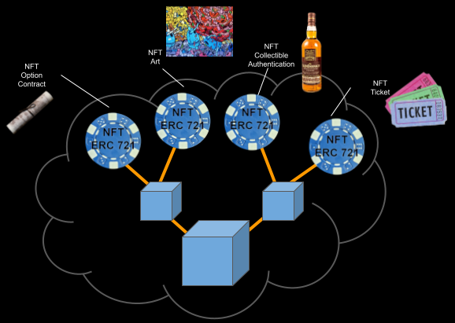](../resources/basics-1.65.pdf)

- In our example the NFT references the digital terms of an agreement between two parties (wallets).
- The agreement is defined by the seller and who creates an NFT to represent that agreement. They advertise the agreement for an amount of a given token.
- The agreement is then bought by the buyer and the NFT ownership NFT is transfered to them
- The Transfer of the NFT is a critical point as it must be legally recognized as transfer of ownership of what the NFT represents

[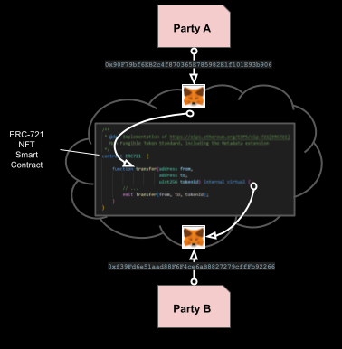](../resources/basics-1.75.pdf)

### Reliable Data

- Often the agreements we make will have to reference some sort of external or market data.
- So, we need a secure way to get this data on chain so it can be used be the smart contracts
- The way this is done is for a data provider to digitally sign the data so that the receiving smart contract can verify the value and the sending wallet.
- The data vendor wallet address could be defined as part of the agreement terms and pre-verified in the same was at https protocol verifies trusted parties with [certificate authorities](https://en.wikipedia.org/wiki/Certificate_authority).
- For this we create a smart contract that allows such values to be injected on-chain and referenced by other smart contracts.

[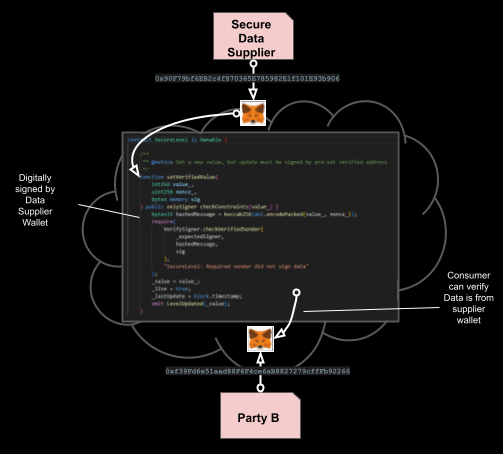](../resources/basics-1.8.pdf)

### Real Value, Stable-"token"

- We want the tokens we buy and settle with to represent a real asset such as curreny, commodity (gold), property etc.
- This is the concept of a "stable token", where the token buys and holds the real asset for every quantity of the token issued, and as such it's value is pegged 1:1 to the value of that asset.
- So, we have an on chain equivalent of the asset, some examples are [tether](https://tether.to/en/) which is a USD stable-coin.
- The process for this is
  - An entity create as stable-coin by issuing a smart-contract for a Token
  - For every unit of the token minted (created) the issuers buys and holds the asset
  - For every unit of the token burned (destroyed) the issue can sell the asset

[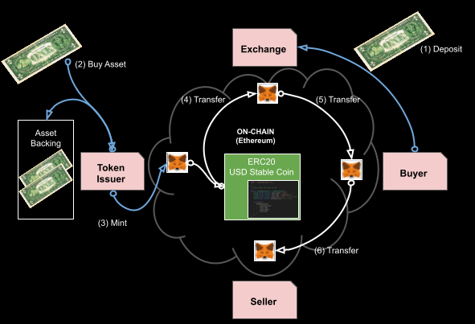](../resources/basics-2.pdf)

[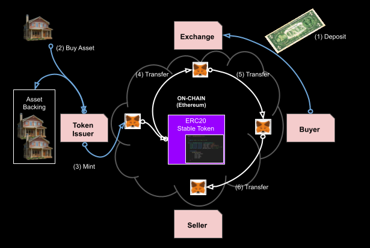](../resources/basics-2.1.pdf)

### Create, Buy, Sell, Settle on chain

1. The option seller defines some agreement terms that may be of interest to a buyer.
2. An NFT is created by the seller to represent these terms that are of interest to a buyer
3. These terms also reference some specific market prices, which are linked a secure on-chain levels wrapped by a smart contract
4. A buyer who finds the terms of value can then have the NFT transfered to them by the seller in exchange for a given amount of a token.
5. The seller and buyer are now obliged to honor the terms of the agreement represented by thr NFT

[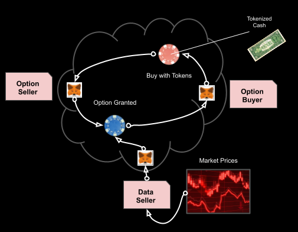](../resources/basics-3.pdf)

1. At some point the seller and or buyer may wish to exit the agreement (if the agreement allows for it)
2. So the value of the agreement is calculated with reference to the secure prices
3. The value is then settled between buyer and seller as a token. The settlement can be in the form any agreed token.
4. Once the value is settled, the NFT is transfered to the original seller, who destroys it.

[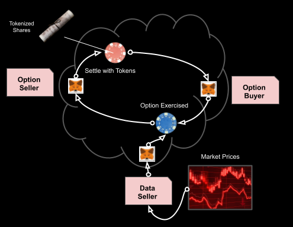](../resources/basics-3.5.pdf)

- It is the process that we have created a fully functional demo application for.

## The application