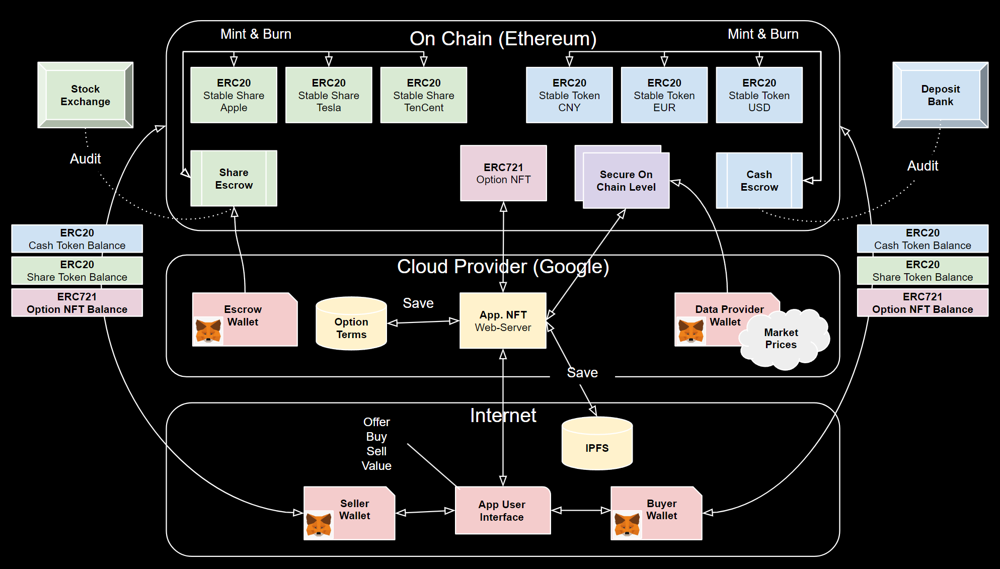

# Project Demo Script

## Notes

This is a script for the demo of the ideas in this project. 

It is written as an interactive question and answer session between a commentator and one or more subject matter experts.

Depending on the audience, a few of the early questions can be asked directly to them in to help engage them with the thought process.

## 0. What are we going to see ?

A live demo of a full, but light weight project for how simple contingent contracts can be
1. Issued as smart contracts on-chain
1. Offered for sale as NFT's and paid for using tokenized cash
1. Purchased, sold and exercised by anyone with a digital wallet
1. Settled with any tokenised asset, cash, shares or ...

## 1. Introduction

1. Q : Why use distributed ledger and smart contracts to build an options platform ?
   - A : Distributed ledger, combined with standard smart contracts ([ERC20](https://ethereum.org/en/developers/docs/standards/tokens/erc-20/), [ERC721](https://eips.ethereum.org/EIPS/eip-721)) is a becoming a rich, secure and low-friction eco-system for peer to peer tokenization and transferable, contingent obligations through non fungible tokens (NFT)
1. Q : How does the help create a market ?
    - A :  ... 
1. Q : What does "on chain" mean ?
   - A : ...
1. Q : Are there different chains or ledgers ?
   - A : ...
1. Q : Where are we in the maturity of this technology ?
   - A : 
1. Q : What is a smart contract ?
   - A : ...
1. Q : Is it free to create and run smart contracts on a chain
   - A : ...
1. Q : What is tokenization?
   - A : ...
1. Q : What is difference between a token and a coin ?
   - A: ...
1. Q : How do we transact real assets on chain ?
   - A : ...
1. Q : Is this secure ?
   - A : ...
1. Q : Given on chain ledger transactions are transparent to all, how can parties be offered privacy ?
   - A : ...
1. Q : Who can interact with a smart contract 
   - A : ...
1. Q : How can we securely identify those who we are interacting with
   - A :
## 2. Objectives
1. Q : What did you show with the demo
   - A : That the eco system of digital wallets, tokenized assets and non-fungible tokens is sufficient to support the issuance, transacting and settlement of contingent contracts.
   - A : Also to increase the organizational intuition for this space with a view to promote thinking about how services could be offered to our customers safely
1. Q : Does ths solution involve commercial exchanges such as Binance or Coinbase ?
   - A : ...
1. Q : Is the solution impacted by the price volatility we see with crypto currencies and crypto market a activity ?
   - A : ...
1. Q : What is currently the biggest challenge with this eco-system
   - A : regulation ...
1. Q : Conversely, what is the biggest positive ?
   - A : Fully decentralized platform, with millions of participants and a rapidly growing and increasingly rich set of standards for tokenization and establishing multi party obligations.
   - A : The service can also scale quickly with marginal costs, which fits well with the market trends we see for ever smaller notional transaction at smaller premiums.
1. Q : What is holding back the further growth
   - A : The number of reputable financial services names present in this eco-system is still low, however as recently as June 2023 we are seeing big names such as Blackrock pushing the Sec for listing of on chain ETFs.
   - A: in addition, there is still a general confusion between crypto coins and the distributed ledger technology that makes them possible. Here we focus on how we leverage the technology not the crypto markets.
   ## 3. Anatomy

   
### 5.1 Participants
1. Q: Who are the participants ?
   - Firstly, we note that all participants must have a digital wallet as this is their on chain identity.
   - The seller, is the party who writes or issues the contracts
   - The buyer, is any party who purchases a contract, directly from the seller or another buyer
   - The Escrow, is a party that holds a physical asset (collateral) and issues backed (ERC20) tokens on chain.
   - The data provider, is a trusted party that injects data on chain, such as asset prices.
1. Q: What are the key components ?
   - Tokenized assets issues as ERC20 tokens
   - NFT's as the means to represent the obligation between seller and buyer
   - The Web server, managed by the seller to hold details of contracts issued behind the NFTs, as well as to price and exercise the contracts.
   - IFPS as a means to store contract details in a decentralized way.
   - Meta-mask, or other third party Wallet able to transact ERC20 tokens or ERC721 NFTs
1. Q: What smart contracts are used.
   - An ERC721 smart contract to manage the NFTs associated with issued contracts
   - A set of ERC20 token to represent the tokenized cash and chares.
   - A set of bespoke contracts that represent the validated an secure prices that drive the contract valuations.
## 6 The Life-cycle
* Done as live demo.
1. Q: What is the life-cycle ?
   - The seller advertises contracts for sale on the Web server.
   - The buyer agrees to purchase a contract.
   - The seller registers the details of the sold contract on the Web server and in IPFS, for which a unique & digitally signed URI is generated.
   - The seller, *mints* an NFT via the ERC7201 smart contract for the agreed terms. Lined to the URI for the option terms.
   - The NTF is transfered from seller to buyer, for payment from buyer of the agreed amount of the agreed token.
   - The data provider (for payment) injects updated prices and the Web server updates the contract price. 
   - The buyer, can choose to sell the NTF to any other digital Wallet holder for the current value.
   - At some point the buyer can choose to exercise the contract, at which point the original seller will pay the current value (if any) to the buyer in the agreed settlement token.
   - The current owner transfers the NTF back to the seller, who *burns* the NFT terminating it's on chain existence for ever.
 
