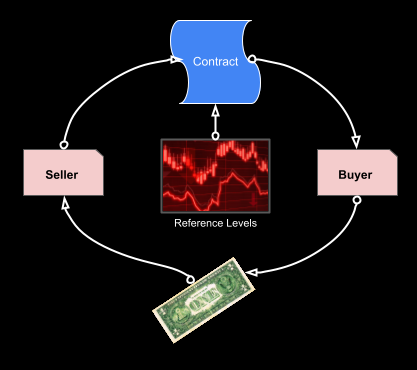
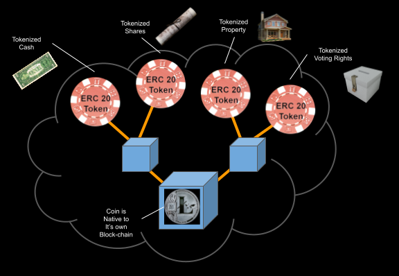
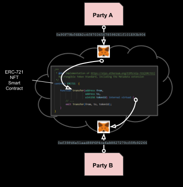

# Demo Script Companion

## Basic concepts

## The Journey "on Chain"

### The beginning

- Contracts: Financial, insurance, Hotel, Flight etc can be offered by a supplier over the internet.
- The contract is offered and agreed over the internet, optionally references some public data and is settled for cash via digital payment.

### What is "on-chain"

- Most services to date, including the internet rely on and are managed by central authorities.
- An on-chain example is [Ethereum](https://en.wikipedia.org/wiki/Ethereum), which is the software and services that provide a platform which is in effect a decentralized super-computer
  - It is decentralized as:
    - it supports people and organizations connecting and transacting **directly** in a secure way
    - the computation and storage is not centrally owned.
  - It has the ability to store and run-programs called smart contracts
- So, "on-chain" is a service (distributed App [dApp](https://en.wikipedia.org/wiki/Decentralized_application)) that has been implemented on top of such as decentralized network
- Operations such as computation and storage are paid for in teh form of "gas fees" which are normally settled between parties using a crypto currency such as [Ether](https://en.wikipedia.org/wiki/Ethereum#Ether).

### What is a Smart Contract

- A smart-contract is a piece of code that runs "on-chain" and forms part of the distributed App [dApp](https://en.wikipedia.org/wiki/Decentralized_application).
- The code is much like other program, except that it can be executed by anyone who has on-chain presence. For this reason the smart-contracts once loaded cannot be modified and have special features that restrict who (which wallet) can execute which functions in the program.
- Another important aspect of these smart contracts is that they can be given common capabilities, an example of this is teh [ERC-20 standard](https://ethereum.org/en/developers/docs/standards/tokens/erc-20/) that is the emerging standard for how all Token behave.
- This standardization means we can build decentralized eco-systems of services that can interact with each other by using the standard capabilities.

### The Move to chain

- First requires that individuals and organizations have a presence on-chain. This comes in the form of a Wallet, which is a secured Id that we use to transact with other entities via their Wallet.
- Every participant has a unique Id that is their on-chain identity. This must be kept secure, with access to the wallet anyone can access the assets associated with that wallet or act as that wallet.
- There are many services such as [Meta-mask](https://metamask.io/) that can create and manage your wallet and track your on-chain assets for you.

### Assets on chain - ERC20 Tokens

- We need a representation of value on-chain. This can be done with digital-coins such as Bit-Coin and Ethereum etc.
- A more flexible option is to use a Token, which is a smart contract that can represent any asset.
- An emerging standard here is ECR20, which gives all tokens the same bae set of behaviors
- This makes it possible for all of the different wallet services to cooperate in exchange of Token and digital coins.
- Tokens can be "asset backed" and represent any asset on-chain, cash, property, shares etc.

- Token are smart contract (code) that manages the basic capabilities of a token
- create more tokens, **minting** in response to more assets being added.
- destroying token, **burning** in response ot assess being disassociated with the token
- **transfer** of a number of tokens from one Wallet to another
- **tracking** the balance of a token against all the holding wallets.

### Agreements (contracts) on Chain

- We have value on chain in the form of Tokens (and coins) we can make (buy) and settle agreements (contracts).
- Now, we need a way to represent the agreement and the how we enter into and exit that agreement.
- For this we can use a [Non Fungible Token (NFT)](https://en.wikipedia.org/wiki/Non-fungible_token)
- The [NFT](https://en.wikipedia.org/wiki/Non-fungible_token) is a smart-contract that has:
  - An owner
  - A means to point at some specific asset or digital agreement
- So, if we create an NFT that is a represents digital ownership of something, we can then transfer the ownership for a fee that can be paid for with a Token (or crypto currency).
- As with tokens there are emerging standards for such NFTs, [ERC-721](https://eips.ethereum.org/EIPS/eip-721) and [ERC-1155](https://ethereum.org/en/developers/docs/standards/tokens/erc-1155/). This gives them standard features that make them easier to manage and transact
  

- In our example the NFT references the digital terms of an agreement between two parties (wallets).
- The agreement is defined by the seller and who creates an NFT to represent that agreement. They advertise the agreement for an amount of a given token.
- The agreement is then bought by the buyer and the NFT ownership NFT is transfered to them
- The Transfer of the NFT is a critical point as it must be legally recognized as transfer of ownership of what the NFT represents

