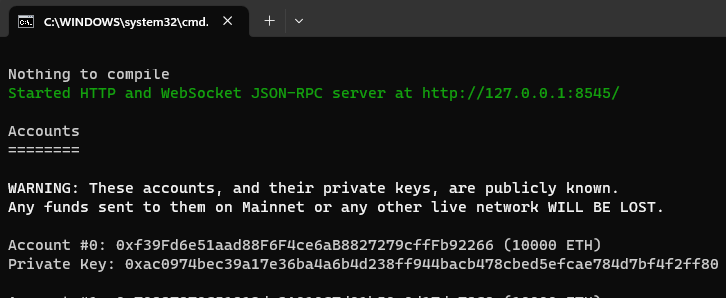
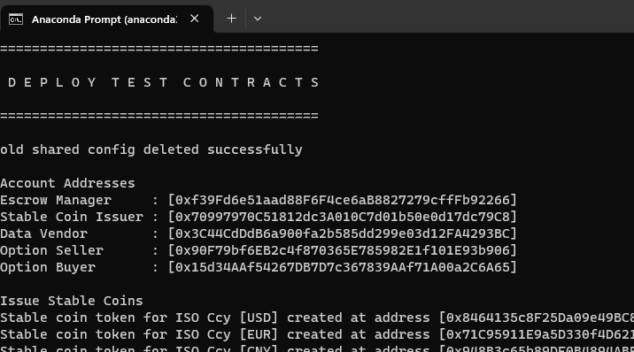
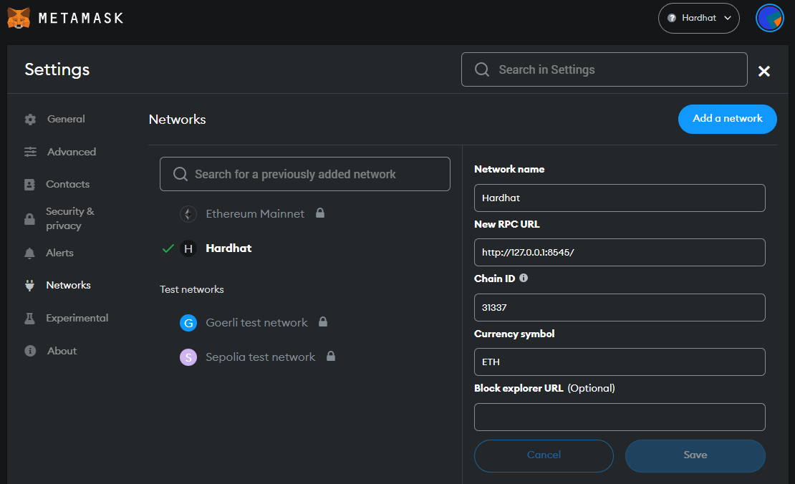
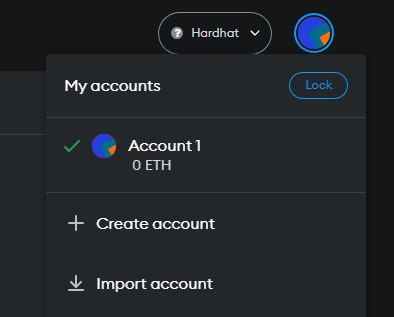
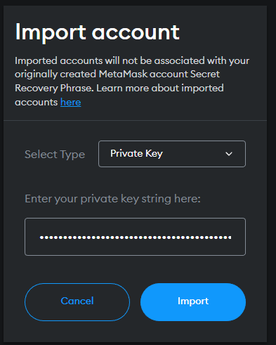
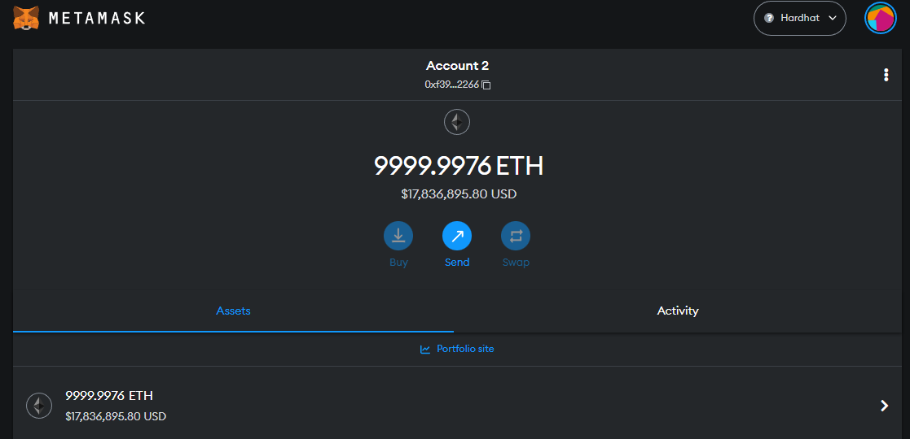

# Start Test UI

## Install Yarn

```text
cd .\frontend
Install [Hardhat](https://www.npmjs.com/package/hardhat)
Install [yarn](https://classic.yarnpkg.com/en/docs/install#windows-stable)
cd ..
```

## Start the Hardhat node

We first need to run up a stand alone Hardhat test network, as below. To do this we must start a new command console and change directory into the project root. 

This Hardhat network is set-up according to the details in ```hardhat.config.js```

```text
npx hardhat node
```
and you should see something as below.



This will start a stand alone node to which we can deploy our test contracts and then connect our UI so that we can interact with those test contracts.

## Deploy the Test Contracts

To deploy our test contracts, we run the deploy script as below.

```text
npx hardhat run --network localhost scripts\deploy\deploy.js
```

When this has run it will have deployed all of the test contracts and exported their details into ```scripts\tmp\sharedConfig.json```. These details can be read by any javascript module using the ```scripts\lib\sharedConfig.js``` utility. 

You should see something like



**note** the ```scripts\tmp\sharedConfig.json``` file is created every-time the deploy script is run. So you cannot use a stale version of this file to get details of the deployed contracts.

## Install MetaMask

If you don't have [Metamask](https://metamask.io/download/) and a Metamask account you will need to install it and create and account.

## Connect MetaMask to Hardhat Test network

The UI will interact with the Hardhat network via MataMask. So you will need to connect Metamask to the Hardhat network that is running and that has the test contracts deployed to it.

You will find the ```RPC URL``` as the first line in the console from which the Hardhat test node was started and the ```chain ID``` in the ```hardhat.config.js``` in the root of the project.

The network name ```Hardhat```, is free text as a name for these settings, however as these settings connect to the local hardhat network, ```Hardhat``` seems like a fitting name.




## Import the Test accounts from the Hardhat Test network.

You will need to import the test accounts from the hardhat test network started above. You will need the private keys of the accounts shown in the console when the network was started.

### 1. Click on Account Icon and select Import



### 2. Copy and paste one of the private keys



### 3. Hit import and you will see the account screen



## Export abi and contract address

The UI needs to know about the contracts that have been deployed to the test network. SO teh command below make the deployment addresses and ```abi``` files available to the UI.

```bash
yarn hardhat run ./scripts/exportToFrontEnd\updateFrontEnd.js --network localhost
```

## Install


```bash
cd ./frontend/
yarn
```

## Run UI

```bash
yarn dev
```

## Using the Front-end

1. In Chrome navigate to [http://localhost:3000/](http://localhost:3000/)
2. right click ```inspect``` to open up the developer window so you can see the console output and other in browser debugging support while developing the UI
3. Hit the connect wallet button and login to your Metamask or other wallet service
4. You should see the Equity price update and you are off an running.
