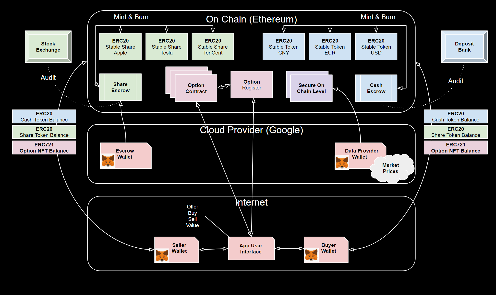

# Project Overview

- [Project Overview](#project-overview)
  - [Goal](#goal)
    - [The Flow](#the-flow)
    - [Concepts](#concepts)
      - [Market Participants](#market-participants)
      - [Stable Coin \& Escrow](#stable-coin--escrow)
      - [Stable Share and Escrow](#stable-share-and-escrow)
      - [Secure Level](#secure-level)
      - [On-chain Option (financial) Contracts](#on-chain-option-financial-contracts)
      - [User Interface](#user-interface)
      - [Gas Fees](#gas-fees)
  - [Design one - Hybrid](#design-one---hybrid)
    - [Contract Management](#contract-management)
    - [Selling](#selling)
    - [Buying](#buying)
    - [Exercise](#exercise)
    - [Valuation](#valuation)
    - [Settlement](#settlement)
  - [Design two - Fully On Chain](#design-two---fully-on-chain)

## Goal

The project goal is to explore creating an on-chain market for financial contracts. We conduct two experiments to investigate the merits of a fully on chain solution and hybrid solution with NFT's on chain and the option terms off chain.

### The Flow

1. Buyer (of options) swaps real cash for on chain stable coin tokens.
2. Seller (of options) offers contracts with a premium payable in a Stable Coin.
3. Seller mints (creates) an on-chain version of the option as either (a) An ERC721 NFT or (b) A fully on chain contract.
4. Buyer pays premium in Stable Coin to seller.
5. Seller Transfers option to Buyer.
6. Option is valued using on-chain reference levels for cash equities, where price is securely updated from trusted off chain source.
7. Buyer exercises option and receives the zero or the positive value of the option paid in an agreed stable coin or stable share
8. The option is reverted to seller who burns (terminates) the option.

### Concepts

#### Market Participants

In the example we have the following participants, all of who identify themselves with a secure on chain wallet. The wallet is both their identity on chain and also the place where ownership of digital assets are registered.

| Participant | Role |
| ----------| -----|
| Seller | The seller of options |
| Buyer | The Buyer of options |
| Data Source | The trusted source of prices & levels |
| Escrow | The account that mints table coins ans stable shares

#### Stable Coin & Escrow

A key advantage of on-chain activity is the ability to settle directly between parties. For this we need an on chain version of cash, known as stable-coin ([ERC20](https://ethereum.org/en/developers/docs/standards/tokens/erc-20/)).
A stable coin is traded 1:1 with its underlying currency, for this 1:1 value to hold the stale-coin issuer must hold the same amount of physical currency (or equivalent) to back the stable coin. In our project we mock this up as an Escrow account that mints and burns Tokens on as 'real' currency is transfer to/from it.

#### Stable Share and Escrow

In our example we also wanted to be able to simulate 'physical' settlement where shares can be delivered as payment instead of cash. The ([ERC20](https://ethereum.org/en/developers/docs/standards/tokens/erc-20/)) token is not cash specific, so we use the same concept to model on chain shares. We use the Escrow account concept again, except this time the account mins/burns stable share tokens based on the deposit / withdrawal of real shares.

#### Secure Level

To value option or any contract we need a trusted source of levels / prices of things on which the option contract depends. We chose to model these as custom on chain secure smart contracts. They are secure as the price can only be updated by the trusted source (Wallet) and where the contract validates that all updates are from that account.

#### On-chain Option (financial) Contracts

This is handled in two way to allow us to investigate the relative merits of the solutions.

1. Option is modeled as an [ERC721](https://eips.ethereum.org/EIPS/eip-721) NFT.
1. Option is modeled as fully on chain custom smart contract

In both cases the flow is the same, but the implementation as running cost is different.

A critical point here from a business point of view that the transfer of the digital asset would need to be recognized legally and by regulators as a transfer of title. This would then be defensible in a legal setting. It would also trigger issues such as stamp-duty and other taxes in the countries where the transfer of title and value was seen to have happened. At the time of writing this document this area is nascent and has many unresolved issues. So this would be the impediment to any real world solution rather than challenges with the technology.

#### User Interface

The market participants need a way to interact. In this technology setting this is most likely to be a Javascript powered Web Page and/or server that interacts with the on and off-chain elements. It's not possible to interact directly with the on-chain contracts, other than having some basic capability via the Waller service such as [MetaMask](https://metamask.io/). This interaction is limited to standardized contract types such as [ERC20](https://ethereum.org/en/developers/docs/standards/tokens/erc-20/) and [ERC721](https://eips.ethereum.org/EIPS/eip-721) which is why we have used them in this example.

#### Gas Fees

All of the on-chain smart contracts run on a network such as [ethereum](https://ethereum.org/en/) or [Polygon](https://wiki.polygon.technology/docs/develop/getting-started). In effect these are distributed compute environments that use distributed ledger technology to manage coins and smart-contracts. They are unable to offer their services for free as they need to pay for the operation of the platform. So to recover this cost they charge [gas fees](https://ethereum.org/en/developers/docs/gas/) for things done on chain such as deploying contracts, running smart contract functions, storing data etc.

We explore the concept of fully on chain and Hybrid because of gas fees, as gas fees can become significant when you perform lots of operations or when the market is busy and resources are contested. So the fully on chain version would be much more expensive in terms of gas fees than the hybrid solution, however the hybrid solution would also have to pay cloud provider fees to host the off chain elements. As such investigating this balance of cost and flexibility is part of our goals.

## Design one - Hybrid

### Contract Management

The financial contract as a transferable entity is defined as a **N**on **F**ungilble **T**oken [(NFT)](https://en.wikipedia.org/wiki/Non-fungible_token). The Option NFT's are managed with the emerging standard [ERC721](https://eips.ethereum.org/EIPS/eip-721). This standard contract offers basic mint, burn and transfer of NFTs.

It works as a single on-chain contract that in effect holds a list of NFT identifiers and their owner (wallet address). As this is a single contract where none of the option terms are held on chain it is efficient in terms of gas fees.

The option terms are held off chain in a WebServer managed by the seller. An [ERC721](https://eips.ethereum.org/EIPS/eip-721) extension is used that allows a [URL](https://en.wikipedia.org/wiki/URL) (web link) to be associated with every NFT. This way we can link the on-chain NFT with the option stored on the WebServer as the URI is the link that will recover the Option terms from the WebServer

We need the option terms to be secure and immutable so they cannot be changed and that there is no dispute between buyer and seller. To do the the option URI includes a signed hash of the option terms. Where the terms are hashed and then signed by the seller. This way **anyone** including the buyer can verify that the option terms recovered from the WebServer are the same as those agreed originally and further they can verify the terms were signed by the seller. As ERC721 contract does not allow the URI to be updated once the NFT is minted the URI becomes an immutable.

record that can find and verify the terms of the option for the life of the option.

### Selling

This is managed on the user interface [buyer view](./interface/seller.md)

1. The seller decides what terms they wish to offer
1. These terms are full off-chain to start with and only exist on teh WebServer
1. For each of the terms, the seller determines the premium to be paid (as an ERC20 token) to enter into the option
1. The buyer then selects the [contract of interest](#buying) and it is at this point the on-chain NFT and other elements are created.
1. This means the seller can offer as many terms as they wish without incurring any [gas fees](#gas-fees) until a buyer comes forward.

### Buying

This is managed on the user interface [buyer view](./interface/buyer.md)

1. The seller WebServer will list a set of as yet un-minted (off chain) options that the buyer can enter into.
1. The buyer can visit the seller WebService and select an option of interest and buy it.
1. The buyer then pays a premium in a given on-chain stable-coin (token) to the seller
1. The seller then saves and signs the option terms and mints via ERC721 an NFT on-chain.
1. The seller then transfers the NFT to the buyer wallet, and it is at this point legal title and binding agreement is established.
1. During the life of the option it can be [valued](#valuation) using the secure on chain levels.
1. The buyer can then [exercise](#exercise) the option at which point any residual value is settled between buyer and seller and the NFT is burned and the terms deleted.

### Exercise

This is managed on the user interface [buyer view](./interface/buyer.md) view.

1. When the buyer wishes to exit the option they exercise it.
1. At this point any residual value is exchanged between buyer and seller.
    1. This is done on chain and settlement is in terms of on-chain token: Stable Coin or Stable-Share
    2. Here is the key value of on-chain contracts as settlement is direct between the parties
1. With the residual value [settled](#settlement) the option must be deleted.
   1. The seller removes the terms from the WebServer & instructs the ERC721 contract to burn the relevant NFT Id.
   2. At this point the binding dependency is terminated
   3. It is also at this point that in financial terms value flows and as such would be the point tax and other regular processes would kick in.

### Valuation

This can be seen on the [buyer view](./interface/buyer.md) view and [seller view](./interface/seller.md)

1. The WebServer managed by the seller, will periodically value the option by getting updated values from the secure on chain levels.
2. The levels are linked to the option when it is created by embedding the on chain contract addresses of the levels.
3. The buyer is then shown the valuation and the levels that were used to arrive at it.
4. The buyer can verify (if they wish) the [option terms](#contract-management) and also the levels, as the levels are public on-chain contracts.

### Settlement

When the option is defined a settlement token and settlement FX are included. So at the point of exercise the residual value is transferred between buyer and seller.

In our example we support Stable-Coin and Stable-Share, but any [ERC20](https://ethereum.org/en/developers/docs/standards/tokens/erc-20/) token could be used. This gives great flexibility to allow parties to define contracts with any payment.

Not shown in our example, but it is also possible to settle in terms of NFTs, working in a more binary way where at exercise the NFT would be transferred or not.

## Design two - Fully On Chain

