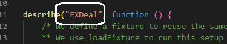

# Running The Tests

## Dependencies

[Hardhat](https://www.npmjs.com/package/hardhat)
[chai](https://www.npmjs.com/package/chai)
[web3](https://www.npmjs.com/package/web3)

## Running

### Run all tests

    npx run test

### Run specific tests

    npx run test --grep FXDeal
    
    npx hardhat test --grep "Link Token"

This will find all patterns `FXdeal` in the files under test directory and run those tests e.g.

